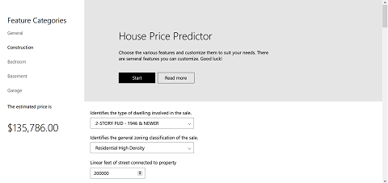
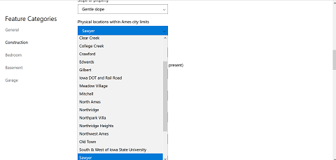
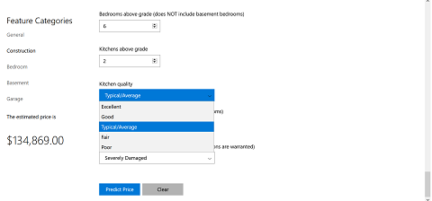
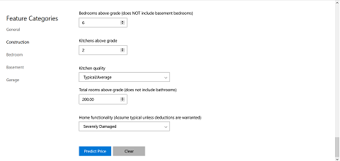

# 0. Introduction
This project focuses on building a web application to predict house prices for house buyers and house sellers.

The value of a house is more than just location and square footage. Houses have several features that make up it's value.We are going to take advantage of all the features to make accurate predictions about the price of any house.

We developed our application using a series of logical steps to ensure that users can easily use the application and make accurate predictions.

0) Introduction
1) Problem definition
2) Solution approach
3) Results and discussions
4) Conclusions
5) Refrences

# 1. Problem definition
We used a simple case study to understand the problem. There are two clients at the same time without a conflict of intreset.

The house buyer, a client that wants to buy their dream home. They have some locations in mind. Now, the client wants to know if the house price matches the value. With the application, they can understand which features are influence the final price. If the final price matches the value predicted by the application the can ensure they are getting a fair price.

The house seller, a client that buys houses, fixes them and then sells houses to make profit. This client wants to take advantage of features that influece the price of a house the most. They typically want to buy a house at a low price and invest in features that will give the highest return.

# 2. Solution approach

1) Define requirements
2) Gather data, analyze and build models
3) Build web backend API to use model
4) Design and develope frontend
7) Intergrate both frontend and backend
8) Test the entire application

## Define requirements
The requriements were gathered from the problem and formally defined.

### User function
* Predict house price
* Customize house parameters
* Assign unique label every prediction
* Save recent predictions

### Operating enviroment
* client/server system (Web)
* client: Web browers
* server: Python/Flask
* database: sqlite
* platform: Python/Javascript/HTML5/CSS3
* Operating system: Windows, Mac, Linux

## 2. Gather data, analyze and build models
Using a common dataset from [here](https://www.kaggle.com/c/house-prices-advanced-regression-techniques/data)

Steps involved:
Loading data and packages we needed for the research. I then
analyzed the data to understand the relationships between the price and other
features, cleaned the data and using some domain knowlegde replaced some
missing values. The next step was feature tranformation to make the data
compatible with the models. Then trained the model and started perfoming
some predictions.

## 3. Build web backend API to use model
Using python and the flask web framework, i built a web API the takes advantage of the model.
The API comsumer can make a request containing JSON map of features and their values. The
flask server recieves this request and sends a response containing the predicted price.

## 6. Design and develope frontend
The User interface of the application was built using HTML, CSS3 and javascript.

## 7. Intergrate both frontend and backend
Using the javascript, data from the forms on the webpage to the flask server is sent
and the server sends a reponse, which is a prediction of the price matching those features

## 8. Test the entire application
Run multiple tests fixed bugs in the code.

# 3. Results and discussions
## Screenshot of the application

I was able to build a web application that can predict the price of a house given certain features. The application runs in the browser and talks to a flask server that is taking data and passing it to a machine learning model.

# 4. Conclusion
There are real world problems that can be solved with machine learning. Some of these solutions can take real world data and make very accurate predictions that can be useful to our daily lives. Users can leverage the power of machine learning without being data scientist when easy to use applications are built around some of these complicated models.

# 5. Refrences

Pedro Marcelino, *Comprehensive data exploration with Python*, Kaggle,  February 2017. Accessed on: April 19, 2021. [Online]
Available: [https://www.kaggle.com/pmarcelino/comprehensive-data-exploration-with-python](https://www.kaggle.com/pmarcelino/comprehensive-data-exploration-with-python)

J. Ade-Ojo, *Predicting House Prices With Machine Learning*, Towards Data Science,  Janurary 8, 2021. Accessed on: April 19, 2021. [Online]
Available: [https://towardsdatascience.com/predicting-house-prices-with-machine-learning-62d5bcd0d68f](https://towardsdatascience.com/predicting-house-prices-with-machine-learning-62d5bcd0d68f)

*House Prices - Advanced Regression Techniques*, Kaggle, Accessed on: April 19, 2021. [Online]
Available: [https://www.kaggle.com/c/house-prices-advanced-regression-techniques](https://www.kaggle.com/c/house-prices-advanced-regression-techniques)

*House Prices EDA*, Kaggle, Accessed on: April 19, 2021. [Online]
Available: [https://www.kaggle.com/dgawlik/house-prices-eda](https://www.kaggle.com/dgawlik/house-prices-eda)
